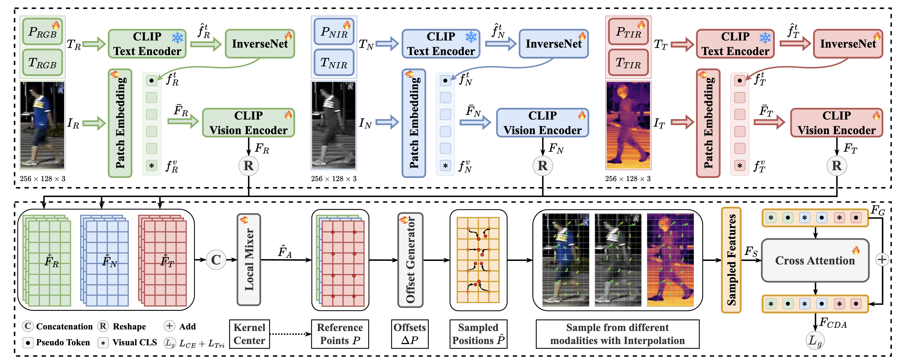

<p align="center">

  <h1 align="center">AW-IDEA: Adaptive Weighted IDEA</h1>
  <p align="center">Course-project extension of <strong>IDEA: Inverted Text with Cooperative Deformable Aggregation for Multi-Modal Object Re-Identification</strong> (CVPR 2025)</p>

  <p align="center">
    
  <p align="center">

</p>

## Về repo này 📌

Repo này được fork từ codebase gốc của paper **IDEA (CVPR 2025)** và giữ nguyên phần lõi của các tác giả (IMFE, InverseNet, CDA, pipeline sinh caption với QwenVL). Phần mình bổ sung cho đồ án môn học là **AW-IDEA (Adaptive Weighted IDEA)**: một module nhỏ, gọn, học trọng số thích ứng theo từng sample cho ba modality RGB/NIR/TIR *trước khi* đưa vào CDA, thay vì coi ba modality có mức ảnh hưởng ngang nhau như bản gốc.

- **Repo gốc:** https://github.com/924973292/IDEA
- **Paper gốc:** [CVPR 2025 Paper](https://arxiv.org/pdf/2503.10324) — Yuhao Wang, Yongfeng Lv, Pingping Zhang, Huchuan Lu.
- **Ý tưởng & kiến trúc AW-IDEA:** [docs/AW_IDEA.md](docs/AW_IDEA.md) (motivation, công thức, config, cách train/eval, ablation).
- **Map chi tiết ý tưởng → code thật (file/class/function cụ thể):** [docs/AW_IDEA_IMPLEMENTATION_PLAN.md](docs/AW_IDEA_IMPLEMENTATION_PLAN.md).
- **Kết quả thực nghiệm (baseline IDEA đã reproduce trên máy nhóm):** [TEST_RESULTS.md](TEST_RESULTS.md).
- **Kết quả AW-IDEA (điền sau khi train thật):** [reports/aw_idea_analysis.md](reports/aw_idea_analysis.md).

Phần còn lại của README này giữ nguyên nội dung gốc của tác giả (Abstract, Introduction, Contributions, Quick Start) để tiện tham khảo và tái lập baseline.

---

## Table of Contents 📑
- [Về repo này (đồ án)](#về-repo-này-)
- [Abstract](#abstract-)
- [Introduction](#introduction-)
- [Contributions](#contributions-)
- [AW-IDEA — Đóng góp của đồ án](#aw-idea--đóng-góp-của-đồ-án-)
- [Reproduction](#quick-start-)
- [Citation](#citation-)

---

## **Abstract** 📝
**IDEA** 🚀 là một framework multi-modal object Re-Identification (ReID) mới, tận dụng **inverted text** và **cooperative deformable aggregation** để giải quyết các bài toán trong ảnh đa phổ phức tạp. Bằng cách tích hợp semantic guidance từ text annotation và tổng hợp thích ứng các đặc trưng cục bộ phân biệt, IDEA đạt kết quả SOTA trên nhiều benchmark.

---

## **Introduction** 🌟

Multi-modal object Re-IDentification (ReID) nhằm truy vấn lại đối tượng cụ thể bằng cách tận dụng thông tin bổ trợ từ nhiều modality. Tuy nhiên, các phương pháp hiện có thường chỉ tập trung fusing đặc trưng thị giác mà bỏ qua lợi ích tiềm năng của **thông tin ngữ nghĩa dựa trên văn bản**.

Để giải quyết vấn đề này, các tác giả đề xuất **IDEA**, một framework học đặc trưng gồm:
1. **Inverted Multi-modal Feature Extractor (IMFE)**: tích hợp đặc trưng đa modal bằng Modal Prefixes và InverseNet.
2. **Cooperative Deformable Aggregation (CDA)**: tổng hợp thích ứng thông tin cục bộ phân biệt bằng cách sinh ra các vị trí lấy mẫu.

Ngoài ra, nhóm tác giả xây dựng ba **benchmark multi-modal object ReID có tăng cường văn bản** dùng pipeline chuẩn hóa để sinh caption bằng Multi-modal Large Language Models (MLLMs). 📝

<p align="center">
    
</p>
<p align="center" style="font-size: 14px; color: gray;">
    Overall framework của IDEA gốc — phần baseline mà AW-IDEA mở rộng thêm.
</p>

---

## **Contributions** ✨

- Xây dựng ba **benchmark multi-modal object ReID có tăng cường văn bản**, cung cấp pipeline sinh caption có cấu trúc trên nhiều modality phổ khác nhau.
- Đề xuất **IDEA**, framework học đặc trưng với hai thành phần chính:
  - **IMFE**: tích hợp đặc trưng đa modal bằng Modal Prefixes và InverseNet.
  - **CDA**: tổng hợp thích ứng thông tin cục bộ phân biệt.
- Kiểm chứng hiệu quả qua thực nghiệm mở rộng trên ba bộ dữ liệu benchmark.

---

## **AW-IDEA — Đóng góp của đồ án** 🧩

**Giả thuyết:** RGB, NIR và TIR không đóng góp đồng đều cho mọi sample. Thay vì đưa cả ba modality vào CDA với mức ảnh hưởng ngang nhau như IDEA gốc, model nên tự học một trọng số theo từng sample cho từng modality *trước khi* CDA thực hiện cooperative deformable aggregation.

**Cách làm (tối giản, không thiết kế lại IDEA):** chèn một module nhỏ — `AdaptiveModalityWeighting` — ngay trước điểm CDA nhận ba local feature map của RGB/NIR/TIR:

```
F_R, F_N, F_T  (đặc trưng cục bộ, không đổi từ CLIP backbone)
   │
   ▼
AdaptiveModalityWeighting(g_R, g_N, g_T) → alpha_R, alpha_N, alpha_T
   │
   ▼
F_R·alpha_R, F_N·alpha_N, F_T·alpha_T
   │
   ▼
CDA(...)  ← không đổi so với IDEA gốc
```

`g_R, g_N, g_T` tái sử dụng chính global/CLS feature mà IDEA đã tính sẵn — không thêm logic trích xuất mới. Nhánh global (`F_G`) đưa vào CDA vẫn giữ nguyên, không bị weighting tác động — chỉ local feature bị scale.

Điểm chính:
- `alpha_m = 3 · softmax(Gate(g_m) / τ)`, nên `alpha_R + alpha_N + alpha_T = 3`.
- Linear layer cuối của gate khởi tạo weight=0, bias=0 → lúc bắt đầu train, `alpha = [1, 1, 1]`, AW-IDEA gần như tương đương IDEA gốc và chỉ lệch dần khi gate học được gì đó.
- Bật/tắt hoàn toàn qua config `MODEL.ADAPTIVE_WEIGHTING.ENABLED` (mặc định `False` — không đổi hành vi IDEA gốc).
- Có sẵn 3 ablation mode (baseline / uniform / learned) để cô lập tác động thật của phần "adaptive".
- Overhead tham số: **33,921 params** (~0.037% so với baseline 91.67M params) — rất nhẹ.

Chi tiết công thức, config đầy đủ, lệnh train/eval, và bảng ablation nằm ở **[docs/AW_IDEA.md](docs/AW_IDEA.md)**.

---

## **Quick Start** 🚀

### Datasets
- **RGBNT201**: [Google Drive](https://drive.google.com/drive/folders/1EscBadX-wMAT56_It5lXY-S3-b5nK1wH)  
- **RGBNT100**: [Baidu Pan](https://pan.baidu.com/s/1xqqh7N4Lctm3RcUdskG0Ug) (Code: `rjin`)  
- **MSVR310**: [Google Drive](https://drive.google.com/file/d/1IxI-fGiluPO_Ies6YjDHeTEuVYhFdYwD/view?usp=drive_link)
- **Annotations**: QwenVL_Anno

### Codebase Structure
```
IDEA_Codes
├── PTH                           # Pre-trained models
│   └── ViT-B-16.pt               # CLIP model
├── DATA                          # Dataset root directory
│   ├── RGBNT201                  # RGBNT201 dataset
│   │   ├── train_171             # Training images (171 classes)
│   │   ├── test                  # Testing images
│   │   ├── text                  # Annotations
│   │   │   ├── train_RGB.json    # Training annotations
│   │   │   ├── test_RGB.json     # Testing annotations
│   │   │   └── ...               # Other annotations
│   ├── RGBNT100                  # RGBNT100 dataset
│   └── MSVR310                   # MSVR310 dataset
├── assets                        # Github assets
├── config                        # Configuration files
├── docs                          # AW-IDEA docs (motivation, plan, ablation)
├── QwenVL_Anno                   # **YOU SHOULD PUT YOUR ANNOTATIONS TO THE DATA FOLDER**
└── ...                           # Other project files
```

### Pretrained Models
- **CLIP**: [Baidu Pan](https://pan.baidu.com/s/1YPhaL0YgpI-TQ_pSzXHRKw) (Code: `52fu`)

### Configuration
- RGBNT201 baseline: `configs/RGBNT201/IDEA.yml` — AW-IDEA: `configs/RGBNT201/AW_lightweight.yml`, `configs/RGBNT201/AW_full_finetune.yml`
- RGBNT100 baseline: `configs/RGBNT100/IDEA.yml`
- MSVR310 baseline: `configs/MSVR310/IDEA.yml` — AW-IDEA: `configs/MSVR310/AW_lightweight.yml`, `configs/MSVR310/AW_full_finetune.yml`

### Training (baseline IDEA)
```bash
conda create -n IDEA python=3.10.13
conda activate IDEA
pip install torch==2.1.1+cu118 torchvision==0.16.1+cu118 torchaudio==2.1.1+cu118 --index-url https://download.pytorch.org/whl/cu118
cd ../IDEA_PUBLIC
pip install --upgrade pip
pip install -r requirements.txt
python train.py --config_file ./configs/RGBNT201/IDEA.yml
```

### Training AW-IDEA
Xem hướng dẫn đầy đủ (warm-start từ checkpoint IDEA cũ, freeze CLIP, ablation) tại **[docs/AW_IDEA.md](docs/AW_IDEA.md)**:
```bash
python train.py --config_file configs/RGBNT201/AW_lightweight.yml
python tools/report_param_overhead.py --config_file configs/RGBNT201/IDEA.yml
python tools/visualize_modality_weights.py --config_file configs/RGBNT201/AW_lightweight.yml --weight <checkpoint>.pth
```

### Training Example (baseline IDEA, từ tác giả gốc)
- **RGBNT201**: [LOGFILE](./assets/train_log.txt) / [WEIGHT](https://pan.baidu.com/s/1t2j9yoVvGp6t0CepxUGpRA)
- **CODE**: g6om

---

## **Citation** 📚

Nếu bạn dùng **IDEA**, vui lòng cite paper gốc:
```bibtex
@inproceedings{wang2025idea,
  title={IDEA: Inverted Text with Cooperative Deformable Aggregation for Multi-Modal Object Re-Identification},
  author={Wang, Yuhao and Lv, Yongfeng and Zhang, Pingping and Lu, Huchuan},
  booktitle={Proceedings of the IEEE/CVF Conference on Computer Vision and Pattern Recognition (CVPR)},
  year={2025}
}
```

Phần mở rộng AW-IDEA trong repo này là sản phẩm của đồ án môn học, xây dựng trên codebase gốc ở trên — không phải công bố học thuật độc lập.

---
